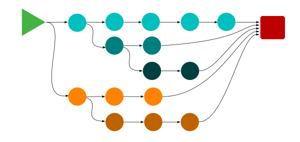
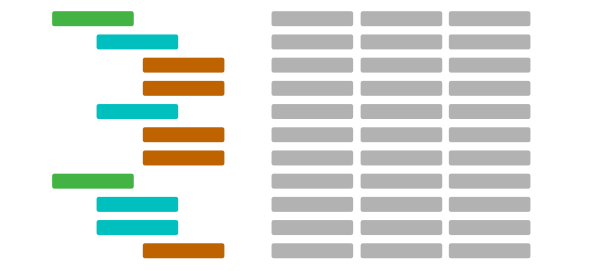
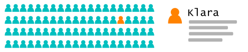

OpenSet is a MIT licensed programmable engine for rapidly extracting behavior from user event data. 

If you have apps, websites, or IoT devices that generate user event data, you might find OpenSet really useful.

OpenSet is a streaming solution and can ingest data at up to 35,000 lines per second per node (fully indexed and replicated). OpenSet has been tested on datasets with millions of users and billions of rows.

| Platform    | Info                             | Status                                                                                                                                                                     |
| :-----------| :------------------------------- | :------------------------------------------------------------------------------------------------------------------------------------------------------------------------- |
| Linux x64   | gcc7.2, release, debug           | [](https://travis-ci.org/opset/openset)                                                              | 
| Windows x64 | Visual C++ 2017, release, debug  | [](https://ci.appveyor.com/project/SethHamilton/openset/branch/master) |

:coffee: **OpenSet is currently pre-release, pre-beta, pre-alpha etc.**

## Links
*  [Documentation](https://github.com/perple-io/openset/tree/master/docs)
*  [Docker Images](https://github.com/perple-io/openset/tree/master/docs/docker)
*  [Sample Code](https://github.com/opset/openset_samples)
*  [Admin Tools](https://github.com/perple-io/openset/tree/master/tools)

## Strong Points

1. Re-evening
2. Sequence Extraction
3. Analytics & Segmentation
4. Person Extraction

### 1. Re-eventing


Translate live event streams into behavioral event streams. For example, translate raw app usage data (clicks and feature usage) into scenario based events. OpenSet can ingest high speed data, and emit behavioral events for single users from that stream. For example:

- people who used your app more than 5 times.
- people that have been actively using your app for 90 days.
- people that have not used feature X in 30 days.
- people that used feature X but not feature Y within their first 14 days.
- people who spent at least $1000 in your app store a year ago, but has spent less than $1000 in the last 365 days.
- people who were in Spain visited Spain but did not visit another European destination within 180 days.

The event emitted will contain a time, an event name and the user ID that triggered the event. Events are emitted within milliseconds of their due time, where they are queued for consumption. Queues listeners can be configured to receive complete subscriptions, or share a subscription to allow for round robin message distribution.

### 2. Sequence Extraction



Extract the common chains of events that lead people to a target behavior.

- extract the countries of origin for people that visited a given destination.
- extract the sequence of countries visited by people that arrived at a given destination.
- extract the app features used by customers before upgrading to your premium plan.

Extract the next thing, or the next _n_ things people do after they perform a target behavior:

- what products are commonly purchased with product X
- what are products purchased within the next 30 days after product X
- what features do users utilize after feature X.

Extract sequences or chains of events between a source and target behavior:

- What countries do people visit after visiting country X, but before visiting country Y.
- What site features do customers use after coming from promo X but before signing up.

### 3. Analytics & Segmentation

OpenSet can generate multi-level pivots with custom aggregations and population counts at parent and child nodes branches. You can specify up to 16 pivot depths, with combinations of event properties, counts, duration values, or date values.



OpenSet brings behavior to segmentation. With OpenSet you can cluster people into segments using event attributes as well as event sequences. Derivative segments can be generated from other segments using intersection, union, complement and difference. Segments can even be compared to extract differences between their respective populations. 


### 4. Person Extraction

Load or stream events (app, web, IoT, etc) into OpenSet and extract the history and attributes for single users in milliseconds. It doesn't matter if you have millions of events, or you are inserting thousand of events per second, OpenSet extract users by ID in real-time.



# example using curl

**1**. Clone the Samples:
```bash
cd ~
git clone https://github.com/opset/openset_samples.git
```

**2**. Install [Docker](https://www.docker.com/) and start OpenSet (interactive):
```bash
docker run -p 8080:8080 -e OS_HOST=127.0.0.1 -e OS_PORT=8080 --rm=true -it opset/openset_x64_rel
```
**3**. Open another console (go to home directory):
```bash
cd ~
```

**4**. Initialize  OpenSet:
```python
curl -X PUT http://127.0.0.1:8080/v1/cluster/init?partitions=24 | json_pp
```

response:
```json
{
   "server_name" : "smiling-donkey"
}
```

**5**. Create a table:

```bash
curl \
-X POST  http://127.0.0.1:8080/v1/table/highstreet \
-d @- << EOF
{
    "columns": [
        {"name": "product_name", "type": "text"}, 
        {"name": "product_price", "type": "double"}, 
        {"name": "product_shipping", "type": "double"}, 
        {"name": "shipper", "type": "text"}, 
        {"name": "total", "type": "double"}, 
        {"name": "shipping", "type": "double"}, 
        {"name": "product_tags", "type": "text"}, 
        {"name": "product_group", "type": "text"}, 
        {"name": "cart_size", "type": "int"}
    ]
}
EOF
```

response:
```json
{
    "message": "created",
    "table": "highstreet"
}
```

**6**. Let's insert some json data from the `openset_samples/data` folder:

```bash
curl \
-X POST http://127.0.0.1:8080/v1/insert/highstreet \
--data-binary @openset_samples/data/highstreet_events.json | json_pp
```

response:
```json
{
   "message": "yummy"
}
```

> :pushpin:  view the event data [here](https://github.com/perple-io/openset/blob/master/samples/data/highstreet_events.json)

**7**.  Let's run a PyQL `events` query

This script can be found at `openset_samples/pyql/simple.pyql` folder.

```bash
curl \
-X POST http://127.0.0.1:8080/v1/query/highstreet/events \
--data-binary @- << PYQL | json_pp
# our pyql script

aggregate: # define our output columns
    count person
    count product_name as purchased
    sum product_price as total_spent with product_name

# iterate events where product_group is 'outdoor'
match where product_group is 'outdoor':
    # make a branch /day_of_week/product_name and
    # aggregate it's levels
    tally(get_day_of_week(event_time()), product_name)

#end of pyql script
PYQL
```

response (counts are people, count product, sum price):
```json
{
   "_" : [
      {
         "g" : 2,         
         "c" : [1, 3, 155.93],
         "_" : [
            {
               "g" : "triple hook jigger",
               "c" : [1, 1, 27.99]
            },
            {
               "g" : "fly rod",
               "c" : [1, 1, 99.95]
            },
            {
               "g" : "deluxe spinner",               
               "c" : [1, 1, 27.99]
            }
         ]
      },
      {
         "g" : 5,
         "c" : [1, 1, 99.95],         
         "_" : [
            {
               "g" : "fly rod",
               "c" : [1, 1, 99.95]
            }
         ]
      },
      {
         "g" : 7,
         "c" : [1, 3, 145.9299],
         "_" : [
            {
               "g" : "gilded spoon",
               "c" : [1, 1, 27.99]
            },
            {
               "g" : "fly rod",               
               "c" : [1, 1, 99.95]
            },
            {
               "g" : "double spinner",
               "c" : [1, 1, 17.9899]
            }
         ]
      }
   ]
}
```

**8**.  Let's make 4 segments (this script can be found at `openset_samples/pyql/segments.pyql` folder):

```bash
curl \
-X POST http://127.0.0.1:8080/v1/query/highstreet/counts \
--data-binary @- << PYQL | json_pp
# our pyql script

segment products_home ttl=300s use_cached refresh=300s:
    # match one of these
    match where product_group in ['basement', 'garage', 'kitchen', 'bedroom', 'bathroom']:
        tally

segment products_yard ttl=300s use_cached refresh=300s:
    # match one of these
    match where product_group in ['basement', 'garage']:
        tally

segment products_outdoor ttl=300s use_cached refresh=300s:
    # match one of these
    match where product_group in ['outdoor', 'angling']:
        tally

segment products_commercial ttl=300s use_cached refresh=300s:
    # match one of these
    match where product_group == 'restaurant':
        tally
        
#end of pyql script
PYQL
```

response (counts are people):
```json
{
   "_" : [
      {
         "g" : "products_commercial",
         "c" : [2]
      },
      {
         "g" : "products_home",
         "c" : [2]
      },
      {
         "g" : "products_outdoor",        
         "c" : [2]
      },
      {
         "g" : "products_yard",        
         "c" : [1]
      }
   ]
}
```

**9**.  Let's query a column:

```bash
curl \
-X GET 'http://127.0.0.1:8080/v1/query/highstreet/column/product_name' | json_pp
```

response (counts are people):
```json
{
   "_" : [
      {
         "g" : "product_name",        
         "c" : [3],
         "_" : [
            {
               "g" : "panini press",
               "c" : [2]
            },
            {
               "g" : "fly rod",
               "c" : [2]
            },
            {
               "g" : "shag rug",
               "c" : [2]
            },
            {
               "g" : "espresso mmachine",
               "c" : [1]               
            },
            {
               "g" : "triple hook jigger",
               "c" : [1]               
            },
            {
               "g" : "gilded spoon",
               "c" : [1]               
            },
            {
               "g" : "double spinner",
               "c" : [1]               
            },
            {
               "g" : "deluxe spinner",
               "c" : [1]
            },
            {
               "g" : "grommet",              
               "c" : [1]
            }
         ]
      }
   ]
}
```
**10**.  Let's query a column in segment compare mode (all `*` against `products_outdoor`:

```bash
curl \
-X GET 'http://127.0.0.1:8080/v1/query/highstreet/column/product_name?segments=*,products_outdoor' | json_pp
```

response (counts are people for each segment):
```json
{
   "g" : "product_name",
   "c" : [3],
   "c2" : [2],
   "_" : [
      {
         "_" : [
            {
               "g" : "panini press",              
               "c" : [2],              
               "c2" : [1]
            },
            {
               "g" : "fly rod",              
               "c" : [2],              
               "c2" : [2]
            },
            {
               "g" : "shag rug",
               "c" : [2],              
               "c2" : [1]
            },
            {
               "g" : "espresso mmachine",
               "c" : [1],              
               "c2" : [0]
            },
            {
               "g" : "triple hook jigger",              
               "c" : [1],
               "c2" : [1]
            },
            {
               "g" : "gilded spoon",
               "c" : [1],
               "c2" : [1]
            },
            {
               "g" : "double spinner",              
               "c" : [1],            
               "c2" : [1]
            },
            {
               "g" : "deluxe spinner",
               "c" : [1],
               "c2" : [1]
            },
            {
               "g" : "grommet",
               "c" : [1],               
               "c2" : [0]
            }
         ]
      }
   ]
}
```

**11.** Let's query a numeric column and `bucket` the results by `50` dollar increments

> :pushpin: note that the distinct user counts are properly counted per bucket. This is useful for making a column histogram.

```bash
curl \
-X GET 'http://127.0.0.1:8080/v1/query/highstreet/column/product_price?bucket=50' | json_pp
```

response (counts are people):
```json
{
   "g" : "product_price",
   "c" : [3],
   "_" : [
      {
         "_" : [
            {
               "g" : 0,             
               "c" : [3]
            },
            {
               "g" : 50,
               "c" : [3]
            },
            {
               "g" : 600,
               "c" : [1]
            }
         ]
      }
   ]
}
```

**12.** Let's do a histogram query using an aggregator

Let's generate a histogram of cart `total`, and bucket by `250` starting at `0` for each person in the database.

The pyql query in the POST body returns a value generated using an inline aggregation function on the database column `table`.

```bash
curl \
-X POST 'http://127.0.0.1:8080/v1/query/highstreet/histogram/customer_value?bucket=250&min=0' \
--data-binary @- << PYQL | json_pp
# our pyql script

return SUM total where total != None # inline aggregation

#end of pyql script
PYQL
```
response (counts are people):

```json
{
   "_" : [
      {
         "g" : "customer_value",
         "c" : [3],         
         "_" : [
            {
               "g" : 750,
               "c" : [1]
            },
            {
               "g" : 500,
               "c" : [0]
            },
            {
               "g" : 250,
               "c" : [1]
            },
            {
               "g" : 0,
               "c" : [1]
            }
         ]
      }
   ]
}
```

**13.** Let's do a another histogram query using time

Let's generate a histogram breaking down the number of weeks since `last_event` for each person in the database.

```bash
curl \
-X POST 'http://127.0.0.1:8080/v1/query/highstreet/histogram/days_since' \
--data-binary @- << PYQL | json_pp
# our pyql script

return int(to_days(now - last_event) / 7)

#end of pyql script
PYQL
```
response (counts are people):

```json
{
   "_" : [
      {
         "g" : "days_since",
         "c" : [3],      
         "_" : [
            {
               "g" : 48,            
               "c" : [1]
            },
            {
               "g" : 47,            
               "c" : [2]
            }
         ]
      }
   ]
}
```

**14.** Let's do a sequence query.

Let's extract `for each product` the `first` product purchased `immediately after` but `not in the same cart`.

```bash
curl \
-X POST http://127.0.0.1:8080/v1/query/highstreet/events \
--data-binary @- << PYQL | json_pp
# our pyql script

aggregate: # define our output columns
    count person
    count product_name as purchased
    sum product_price as total_revenue with product_name

# search for a purchase event
match where action is 'purchase': # match one
    # store the name of the product matched
    first_matching_product = product_name

    # move to next row in user record. We don't want
    # match products in the intial match
    iter_next()

    # match 1 row, or only the products in the purchase event
    # immediately following the product match above
    match 1 where action is 'purchase' and
            product_name is not first_matching_product:
        tally(first_matching_product, product_name)
    # loop back to top

#end of pyql script
PYQL
```

response (counts are people, count product, sum price):
```json
{
   "_": [
      {
         "g": "shag rug",         
         "c": [2, 4, 885.92],
         "_": [
            {
               "g": "panini press",
               "c": [2, 2, 135.98]
            },
            {
               "g": "espresso mmachine",               
               "c": [1, 1, 649.99]
            },
            {
               "g": "fly rod",
               "c": [1, 1, 99.95]
            }
         ]
      },
      {
         "g": "panini press",
         "c": [1, 3, 145.9299],         
         "_": [
            {
               "g": "gilded spoon",
               "c": [1, 1, 27.99]
            },
            {
               "g": "fly rod",               
               "c": [1, 1, 99.95]
            },
            {
               "g": "double spinner",
               "c": [1, 1, 17.9899]
            }
         ]
      },
      {
         "g": "fly rod",
         "c": [1, 2, 45.9799],         
         "_": [
            {
               "g": "gilded spoon",
               "c": [1, 1, 27.99]
            },
            {
               "g": "double spinner",
               "c": [1, 1, 17.9899]
            }
         ]
      },
      {
         "g": "grommet",
         "c": [1, 2, 717.98],         
         "_": [
            {
               "g": "espresso mmachine",               
               "c": [1, 1, 649.99]
            },
            {
               "g": "panini press",
               "c": [1, 1, 67.99]
            }
         ]
      }
   ]
}
```

**How does the sequence query work?**

Event queries use row iteration. Internally rows pertaining to a person are grouped and sorted with that person making sequence extraction easy.

In this case we want to find the products purchased immediately after another purchase. We do so by iterating events and matching the `purchase` event. When we match we perform a nested match for another `purchase` event and `tally` the `product_name` from second match under the `product_name` from the first match. The aggregators count `people` and `product_name` and sum `product_price`.


# RoadMap

OpenSet is pre-alpha. There are many items on the wish list, then there are things that need to be done so we can move to an alpha release. Follow this repo to watch the action.

# Inspiration

My name Seth Hamilton, I've written commercial software my entire life. 

My first product was released in 1992  ---  a graphical BBS product called RoboBOARD. After that came web analytics (DeepMetrix) and network monitoring (ipMonitor). My last startup (rare.io) did marketing automation. In all I've founded three startups, and I've been involved in two major acquisition --- by all measures I have had an exciting career. 

However, in 2015 I found myself writing my first resume and came to a realization. Despite writing millions of lines of code, I actually couldn't prove I had written anything. 100% of the code I had written was owned by someone else at that point in time. 

I love programming, I've been doing it since I was kid, and I especially love C++ (C++11 and beyond are game changing), and extra love messing with data (who doesn't). So, I thought this useful solution might be a good project to give back to the community.

**So, why does this even exist?**

Way back in 2005 I came across an interesting problem while at DeepMetrix. We produced an excellent little product called LiveStats. Everyday a million websites got their metrics using our software.

LiveStats created roughly 40 reports. The reports were predefined and continuously updated using data from weblogs and page-scripts.

This approach seemed perfect... until one day Anheuser-Busch called (they make a beer you've probably heard of). Bud wanted to drill into their data, and they wanted to see their data grouped and tabulated as saw fit, and they wanted this all in real-time. It was a compelling problem and they were willing to pay handsomely if we could solve it.

Unfortunately, we had to say no. We didn't have the technology or the capacity to handle their requirements at that time. Back then most servers were 32bits, 4 cores was a lot and 4GB was twice as much as you could actually address... not to mention enterprise class hard drives had less capacity than your typical smartphone today... and... our stack was SQL.

Failure got me thinking, and here we are today.

# Licensing

#### The MIT License

Copyright (c) 2015-2017, Seth Hamilton and Perple Corp.

Permission is hereby granted, free of charge, to any person obtaining a copy
of this software and associated documentation files (the "Software"), to deal
in the Software without restriction, including without limitation the rights
to use, copy, modify, merge, publish, distribute, sublicense, and/or sell
copies of the Software, and to permit persons to whom the Software is
furnished to do so, subject to the following conditions:

The above copyright notice and this permission notice shall be included in all
copies or substantial portions of the Software.

THE SOFTWARE IS PROVIDED "AS IS", WITHOUT WARRANTY OF ANY KIND, EXPRESS OR
IMPLIED, INCLUDING BUT NOT LIMITED TO THE WARRANTIES OF MERCHANTABILITY,
FITNESS FOR A PARTICULAR PURPOSE AND NONINFRINGEMENT. IN NO EVENT SHALL THE AUTHORS OR COPYRIGHT HOLDERS BE LIABLE FOR ANY CLAIM, DAMAGES OR OTHER LIABILITY, WHETHER IN AN ACTION OF CONTRACT, TORT OR OTHERWISE, ARISING FROM, OUT OF OR IN CONNECTION WITH THE SOFTWARE OR THE USE OR OTHER DEALINGS IN THE SOFTWARE.


